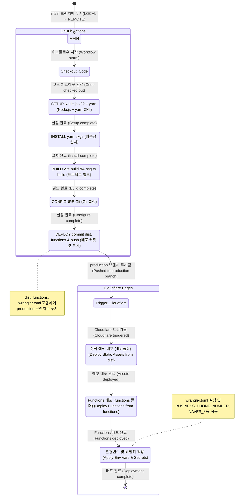

# [LEEBOSU.COM](https://leebosu.com)

https://leebosu.com

> Website for my father's home repair business

## Tech Stack / 기술 스택

- **Framework:** React ^19.0.0 (using `create-vite --template react-swc-ts`)
- **Styling:** Tailwind CSS v4.1
- **Build Tool: `Vite`**
- **SSG(MPA)+CSR:** `vite-plugin-ssr` (Minimal CSR: only `/book` route is client-rendered)
- **State Management:** React Hooks (incl. `useActionState`, `useTransition`), `localStorage` for form persistence
- **Package Manager:** Yarn
- **Deployment : Github Actions + Cloudflare Pages**

## USER FLOW / 사용자 흐름

- **Landing Page 랜딩 페이지 (`/`)**:
  - Introduces the service, shows pricing samples, and has a CTA ("지금 바로 예약하기") to the booking form.
  - 서비스 소개, 가격 샘플 표시, 예약 폼으로 연결되는 CTA ("지금 바로 예약하기") 포함.
- **About Page 소개 페이지 (`/about`)**:
  - Provides more detail about Lee Bosu, his experience, and pricing philosophy. Includes a CTA ("예약하러 가기") to the booking form.
  - 이보수 상세 소개 (경험, 가격 정책). 예약 폼으로 연결되는 CTA ("예약하러 가기") 포함.
- **Booking Form 예약 폼 (`/book`)**:
  - Accessible via CTAs on other pages. / 다른 페이지의 CTA를 통해 접근 가능.
  - Mobile-first, dialog-style multi-step form. / 모바일 우선, 대화형 다단계 폼.
  - Steps: Service Category -> Subcategory -> Date -> Location -> Contact Info. / 단계: 대분류 -> 소분류 -> 날짜 -> 지역 -> 연락처.
  - Shows an estimated price before submission. / 제출 전 예상 견적 표시.
  - No user login required. / 사용자 로그인 불필요.
- **Submission 제출**:
  - User confirms the booking. A confirmation message is shown, indicating details will be sent via SMS(NAVER SENS).
  - 사용자가 예약 확정. 예약 내용이 SMS(네이버 SENS)로 전송될 것임을 알리는 확인 메시지 표시.

## BUILD & DEPLOY PIPELINE / 빌드 및 배포 파이프라인

## CURSOR Rules

- Cursor IDE의 rules를 적용하여 다음 원칙을 지키려 했습니다.
  1. Ask 모드 위주로 사용한다.
  2. 모르는 코드는 기술 부채다.
  3. 주석을 작성한다.
-  `cursor`를 사용하며 느낀 점과 자세한 LLM 사용 원칙과을 추후 블로그에 남기겠습니다.

### Development Guidelines / 개발 가이드라인
[always.mdc](https://github.com/0teklee/leebosu/tree/main/cursor/always.mdc)
- **Test First:** Run tests before any code changes / 코드 변경 전 테스트 실행 필수
- **File Structure:** Use `tree` command to understand codebase structure / `tree` 명령어로 코드베이스 구조 파악
- **Dependency Management:** Use Yarn / Yarn 패키지 매니저 사용
- **Frontend Stack:**
  - Tailwind CSS v4.1 for styling / 스타일링
  - React ^19.0.0 with modern patterns / 최신 React 패턴 적용
  - Maximize usage of React 19's hooks and concurrency features / React 19 훅스와 동시성 기능 적극 활용

### Git Commit Convention / 깃 커밋 규칙
[git-commit.mdc](https://github.com/0teklee/leebosu/tree/main/cursor/git-commit.mdc)

- **Format:** Follow Angular commit convention / Angular 커밋 컨벤션 준수
- **Grouping:** Group related files and changes in single commit / 연관된 파일과 변경사항 하나의 커밋으로 그룹화
- **Scope:** Target modified and untracked files from git status / git status의 수정 및 추적되지 않은 파일 대상
- **Exclusion:** Exclude yarn.lock from commits / yarn.lock 파일 커밋에서 제외
